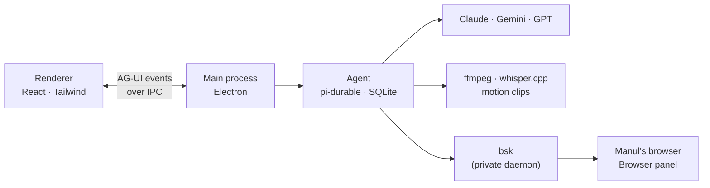

<p align="center">
  
</p>

<h1 align="center">Contributing to Manul</h1>

<p align="center">
  How to run Manul from source, how it fits together, and how to send a change.<br>
  <a href="README.md">README</a> &nbsp;·&nbsp; <a href="ROADMAP.md">Roadmap</a> &nbsp;·&nbsp; <a href="RELEASING.md">Releasing</a>
</p>

---

## Run it

```bash
git clone git@github.com:hormuz-labs/manul.git && cd manul
npm install                  # also fetches the pinned ffmpeg/ffprobe and BrowserSkill for this machine
./scripts/build-whisper.sh   # builds the bundled whisper-cli (needs cmake: brew install cmake)
npm run dev                  # Manul, with hot reload
```

Add a key in **Settings → Keys** (⌘,), drop a video on the start screen, and ask for something.

| Command | What it does |
|---|---|
| `npm run dev` | The app with hot reload |
| `npm run typecheck` | TypeScript, no emit |
| `npm test` | Unit and integration tests (Vitest) |
| `npm run test:e2e` | The real app, end to end (Playwright) |
| `npm run smoke` | Builds, launches, screenshots each screen (set `GEMINI_API_KEY` and pass a prompt to test the agent) |
| `node scripts/screenshot.mjs` | Takes a demo screenshot of a staged project (`docs/screenshot.png`) |
| `node scripts/annotate.mjs <spec.json>` | Turns screenshots into the README's annotated images (arrows, labels, blurred areas) |
| `npm run package` | `dist/`: macOS `.dmg` + `.zip`, or Linux `.deb` + AppImage |

## How it fits together



| | |
|---|---|
| **Shell** | Electron: real Chromium for WebCodecs, frame-exact clip rendering, and a browser the agent can drive |
| **Agent** | [pi-durable](https://www.npmjs.com/package/@earendil-works/pi-durable): every conversation and tool call is saved before it's shown, so a crash resumes mid-run |
| **Agent ↔ UI** | [AG-UI](https://docs.ag-ui.com) events: tool cards, permission cards, live state |
| **Media** | Our own pinned static ffmpeg 9.0.2 and whisper.cpp builds; heavy tools download on demand, checksummed |
| **Motion clips** | HTML + GSAP on Manul's clock, stepped frame by frame in an offscreen Chromium and piped to ffmpeg |
| **Agent browser** | [BrowserSkill](https://github.com/Tencent/BrowserSkill) (`bsk`), bundled and private: its own daemon home and port, the extension running inside Manul's browser on a rebuilt Chrome extension API. A bsk installed in the user's Chrome never sees it; Settings → Browser can switch to the user's Chrome on purpose |
| **Skills & memory** | Plain `SKILL.md` folders grouped into profiles; memory is one fact per file |
| **Updates** | The app via GitHub releases; skills over the air from an Ed25519-signed feed |

### Where things live

| Folder | What lives there |
|---|---|
| `src/main` | Electron main: projects, keys, media tools, the agent and its AG-UI adapter, the browser (`browser.ts`) and bsk (`bsk.ts`) |
| `src/preload` | The bridge to the window, and the Chrome extension API rebuilt for BrowserSkill (`chrome-shim.ts`) |
| `src/renderer` | React + Tailwind; `views/` are the screens, `components/ui/` the primitives |
| `src/shared` | Types and pure logic used on both sides (timeline, export, mix) |
| `resources` | Bundled skills, clip runtime, fonts; `bin/` and `bsk-ext/` are fetched on install |
| `test` | Vitest tests; `test/e2e` drives the real app |

## Tests

Manul is **test-driven**: every change comes with tests, and the suites run before each commit.

```bash
npm test           # unit + integration (Vitest); Electron is stubbed, ffmpeg is real
npm run test:e2e   # the real app: clips, export, menu, proxies, tabs, mix, browser, conversations
npm run package:dir && node test/e2e/packaged.e2e.mjs   # the packaged app: tools, clips, skills, export from the bundle
MANUL_TEST_TOOLS=<tools folder with whisper installed> npm test   # also runs the downloaded-engine test
```

Tests that need something this machine lacks (whisper.cpp, macOS `say`, an installed tool, an API key) skip themselves.

## Sending a change

1. **Pick something.** Find an item in the [roadmap](ROADMAP.md) (or open an issue), and mark it 🚧 with your handle.
2. **Talk first** about anything that changes an architecture decision above.
3. **Keep it small.** One roadmap item per pull request is ideal.
4. **Bring tests.** A change without tests isn't done. CI runs typecheck, unit tests and a build on macOS and Linux.
5. **Match the house style.** Plain, short comments that say *why*; sections separated by shade rather than lines in the UI.

Releases (signing, Homebrew, apt) are covered in [RELEASING.md](RELEASING.md).

## License

By contributing you agree your work is released under the [GPL-3.0](LICENSE).
