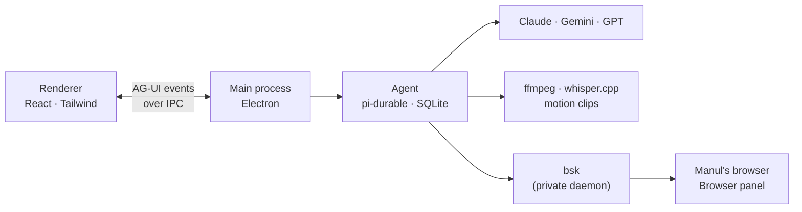

<p align="center">
  
</p>

<h1 align="center">Contributing to Manul</h1>

<p align="center">
  How to run Manul from source, how it fits together, and how to send a change.<br>
  <a href="README.md">README</a> &nbsp;·&nbsp; <a href="ROADMAP.md">Roadmap</a> &nbsp;·&nbsp; <a href="RELEASING.md">Releasing</a>
</p>

---

## Run it

This section is for **contributors building from source**, not installation prerequisites for users.
The Windows release is configured as one offline, one-click per-user installer with shortcuts and launch
after install; no repositories or developer tools required. Windows releases are not yet validated/published.

Use **Node >=22.19.0**, npm, Git, CMake and a native C/C++ compiler. On macOS: `brew install cmake`;
on Debian/Ubuntu: `sudo apt install cmake build-essential`.

```bash
git clone git@github.com:hormuz-labs/manul.git && cd manul
npm install                  # also fetches the pinned ffmpeg/ffprobe and BrowserSkill for this machine
npm run build:whisper         # builds the bundled whisper-cli; preserves the existing Unix build path
npm run dev                  # Manul, with hot reload
```

### Windows x64 (configured, not yet validated)

For source development, use Windows 10 version 1903 (build 18362) or newer / Windows 11, native x64 Node,
Git for source checkout, CMake, and **Visual Studio 2022 Build Tools** with
**Desktop development with C++**, the MSVC x64 toolset and a Windows SDK. Run from PowerShell;
Git Bash is not an end-user requirement. CMake uses the Visual Studio generator, not MinGW.

```powershell
git clone https://github.com/hormuz-labs/manul.git
Set-Location manul
npm ci
npm run build:whisper
npm run dev
```

Downloads use pinned SHA-256 checksums and in-process ZIP extraction, so Windows needs no external `unzip`.
Windows whisper-cli is CPU-only, static CRT (`/MT`), no OpenMP, explicit x64 SSE2 baseline (AVX/AVX2 disabled).
Its embedded `activeCodePage=UTF-8` manifest requires Windows 10 **1903/build 18362** or newer. The process
uses UTF-8 for narrow argv/input/output paths, matching upstream's UTF-8 model loader, without changing the
system locale or the pinned upstream sources. A small CMake wrapper adds only the manifest; the build
verifies the final PE manifest and rejects older cached builds without it.
CI inspects PE dependencies to avoid relying on a developer machine's VC++ Redistributable.
The pinned `bsk.exe` imports `VCRUNTIME140.dll`; `build:whisper` also copies that x64 redistributable from
Visual Studio's `VC/Redist/MSVC` (or `VCToolsRedistDir`), and CI verifies its Microsoft signature.

Add a key in **Settings → Keys** (⌘,), drop a video on the start screen, and ask for something.

| Command | What it does |
|---|---|
| `npm run dev` | The app with hot reload |
| `npm run typecheck` | TypeScript, no emit |
| `npm test` | Unit and integration tests (Vitest) |
| `npm run test:e2e` | The real app, end to end (Playwright) |
| `npm run smoke` | Builds, launches, screenshots each screen (set `GEMINI_API_KEY` and pass a prompt to test the agent) |
| `node scripts/screenshot.mjs` | Takes a demo screenshot of a staged project (`docs/screenshot.png`) |
| `node scripts/annotate.mjs <spec.json>` | Turns screenshots into the README's annotated images (arrows, labels, blurred areas) |
| `npm run build:whisper` | Native whisper.cpp build, including Windows CMake/MSVC |
| `npm run test:packaging` | Focused packaging scripts/config tests, independent of runtime suites |
| `npm run package` | Native `dist/`: macOS `.dmg` + `.zip`, Linux `.deb` + AppImage, Windows x64 NSIS `.exe` |
| `npm run package:dir` | Native unpacked app for packaged E2E checks |

Packaging fails early on missing/stale tools or assets. Build on the target OS and architecture:
electron-builder's `${platform}` resource macro is the **host** platform; fetching `--all` does not enable
cross-packaging. Windows local builds may be unsigned with no secrets set and are for testing only.
Optional signing and mandatory public-release signing are described in [RELEASING.md](RELEASING.md).

## How it fits together



| | |
|---|---|
| **Shell** | Electron: real Chromium for WebCodecs, frame-exact clip rendering, and a browser the agent can drive |
| **Agent** | [pi-durable](https://www.npmjs.com/package/@earendil-works/pi-durable): every conversation and tool call is saved before it's shown, so a crash resumes mid-run |
| **Agent ↔ UI** | [AG-UI](https://docs.ag-ui.com) events: tool cards, permission cards, live state |
| **Media** | Our own pinned static ffmpeg 9.0.2 and whisper.cpp builds; heavy tools download on demand, checksummed |
| **Motion clips** | HTML + GSAP on Manul's clock, stepped frame by frame in an offscreen Chromium and piped to ffmpeg |
| **Agent browser** | [BrowserSkill](https://github.com/Tencent/BrowserSkill) (`bsk`), bundled and private: its own daemon home and port, the extension running inside Manul's browser on a rebuilt Chrome extension API. A bsk installed in the user's Chrome never sees it; Settings → Browser can switch to the user's Chrome on purpose |
| **Skills & memory** | Plain `SKILL.md` folders grouped into profiles; memory is one fact per file |
| **Updates** | The app via GitHub releases; skills over the air from an Ed25519-signed feed |

### Where things live

| Folder | What lives there |
|---|---|
| `src/main` | Electron main: projects, keys, media tools, the agent and its AG-UI adapter, the browser (`browser.ts`) and bsk (`bsk.ts`) |
| `src/preload` | The bridge to the window, and the Chrome extension API rebuilt for BrowserSkill (`chrome-shim.ts`) |
| `src/renderer` | React + Tailwind; `views/` are the screens, `components/ui/` the primitives |
| `src/shared` | Types and pure logic used on both sides (timeline, export, mix) |
| `resources` | Bundled skills, clip runtime, fonts; `bin/` and `bsk-ext/` are fetched on install |
| `test` | Vitest tests; `test/e2e` drives the real app |

## Tests

Manul is **test-driven**: every change comes with tests, and the suites run before each commit.

```bash
npm test           # unit + integration (Vitest); Electron is stubbed, ffmpeg is real
npm run test:e2e   # the real app: clips, export, menu, proxies, tabs, mix, browser, conversations
npm run test:packaging   # no runtime suite; native Windows CI also downloads the pinned model and tests Unicode paths
npm run package:dir && node test/e2e/packaged.e2e.mjs   # the packaged app: tools, clips, skills, export from the bundle
MANUL_TEST_TOOLS=<tools folder with whisper installed> npm test   # also runs the downloaded-engine test
```

Tests that need something this machine lacks (whisper.cpp, a speech model, an installed tool, an API key) skip themselves.
The packaged E2E is different: a missing package is an error, never a skip. On Windows it verifies
`dist/win-unpacked/Manul.exe` and its bundled `.exe` tools, fonts, skills, import, motion rendering and export.
Do not run `scripts/smoke-windows-installer.ps1` locally: it is restricted to disposable GitHub-hosted runners,
whose real per-user registry and shell folders are isolated from developer installations.
The one-click smoke still overrides its temporary path with NSIS `/D` (no directory-selection wizard),
uses `/S` to suppress auto-launch, and verifies Desktop/Start menu shortcuts and their removal.

Native Windows `test:packaging` always checks the embedded whisper manifest. On GitHub Actions it also
downloads the exact multilingual `ggml-base.bin` (147,951,465 bytes, SHA-256 pinned) into a temporary
Unicode/space/`[]` model path and transcribes the real speech fixture to Unicode/`[]` JSON, TXT and SRT paths.
For local native acceptance, set `MANUL_TEST_WHISPER_MODEL` to that exact model before running the tests,
or explicitly run `node scripts/smoke-whisper-paths.mjs --download-model`. Other platforms skip these
Windows-only checks; local Windows without an explicit model skips only the real transcription check.

## Sending a change

1. **Pick something.** Find an item in the [roadmap](ROADMAP.md) (or open an issue), and mark it 🚧 with your handle.
2. **Talk first** about anything that changes an architecture decision above.
3. **Keep it small.** One roadmap item per pull request is ideal.
4. **Bring tests.** A change without tests isn't done. CI runs typecheck and unit tests on macOS/Linux/Windows, plus a native Windows x64 packaging/E2E/installer lane and real-model Unicode-path transcription. Clean-Windows acceptance is still a release gate.
5. **Match the house style.** Plain, short comments that say *why*; sections separated by shade rather than lines in the UI.

Releases (signing, Windows NSIS, Homebrew, apt) are covered in [RELEASING.md](RELEASING.md).

## License

By contributing you agree your work is released under the [GPL-3.0](LICENSE).
