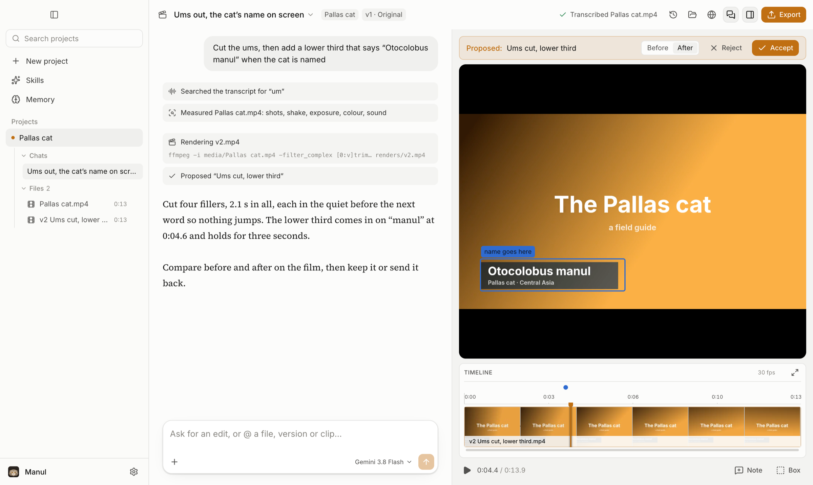
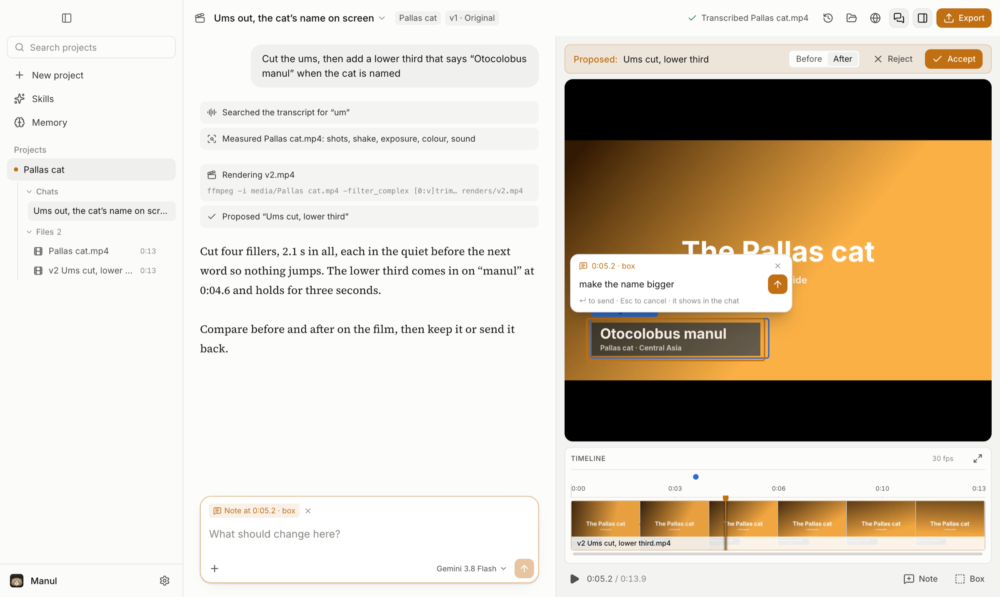
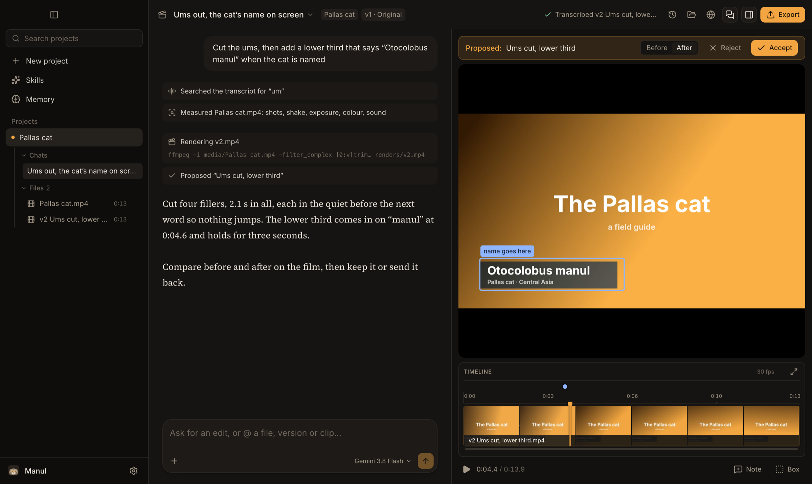

<p align="center">
  
</p>

<h1 align="center">Manul</h1>

<h3 align="center">Direct your video. Manul edits it.</h3>

<p align="center">
  Drop in your footage, say what you want, and point at the frame when something's off.<br>
  Manul makes the cut on your own computer and shows you a before / after of every change.<br>
  You never have to touch a timeline.
</p>

<p align="center">
  
  
  <a href="LICENSE"></a>
</p>

<p align="center">
  <a href="#get-manul"><b>Get Manul</b></a> &nbsp;·&nbsp;
  <a href="ROADMAP.md"><b>Roadmap</b></a> &nbsp;·&nbsp;
  <a href="CONTRIBUTING.md"><b>Contribute</b></a>
</p>

<br>

https://github.com/user-attachments/assets/084276fb-6129-47e2-9cba-4724c1432990

<p align="center"><sub>90 seconds with Manul, starring the grumpiest cat on Earth. Pallas's cat footage: BBC, <i>Frozen Planet II</i>.</sub></p>

<br>

<p align="center">
  
</p>

<br>

## Why it's different

Video editors make **you** operate them. AI video tools take your footage away and hand back whatever they made. Manul works the way a director works with a good editor in the room.

<table>
<tr>
<td width="50%" valign="top">


### You point. It edits.
Draw a box around a number plate that needs blurring. Drag across the sentence that drags on. Click the one word in a title that's wrong. Your note sits on that exact spot and moment, and that's the spot Manul changes.

</td>
<td width="50%" valign="top">


### It proposes. You decide.
Nothing is overwritten. Every edit arrives as a new version you can scrub before and after, then keep or send back with a reply. Every version you ever kept is one click away.

</td>
</tr>
<tr>
<td width="50%" valign="top">


### Your pixels stay real.
Manul cuts **your** footage. It never swaps your shots for generated ones: generated b-roll is coming, but only where you ask, labelled as generated. Titles, lower thirds and captions are real typography, drawn frame-perfect, and you can still drag the words around after Manul has made them.

</td>
<td width="50%" valign="top">


### Your footage stays home.
No upload queue, no cloud project, no waiting for a render farm. The editing and even the transcription run on your computer. The AI you bring your own key for only ever sees text and still frames.

</td>
</tr>
</table>

## Point, then say it

The conversation fills the window, and your film plays beside it with each proposal ready to compare. To point at something, draw a box on the picture (<kbd>B</kbd>), drag across the timeline, or press <kbd>N</kbd> at a moment, and a message box opens right there: say what should change and press <kbd>↵</kbd>. It goes to Manul with what you pointed at, and shows in the conversation like anything else you send.

<p align="center">
  
</p>

Your projects are in the sidebar, the one on screen opened up into its chats and its files: click a file to attach it to your next message, or drag footage onto the timeline to put it in the film. Drag a piece by its name to move it somewhere else; <kbd>⌘Z</kbd> takes any of it back. Drag a divider to give the film more room, or keep dragging to fold a pane away.

<table>
<tr>
<td width="50%"></td>
<td width="50%"></td>
</tr>
</table>

<sub>Light by default, dark if you prefer, or follow the system: <b>Settings → Appearance</b>.</sub>

## What a session feels like


> **You:** cut the ums, and the bit where I lose my train of thought
>
> **Manul:** Cut 9 fillers and the restart at 0:42. *2:31 → 2:12.* &nbsp; `before / after` &nbsp; **Keep** · **Send back**
>
> **You:** *(draws a box over a parked car, 0:18–0:24)* blur this number plate
>
> **Manul:** Blurred that box from 0:18 to 0:24. The rest of the shot is untouched.
>
> **You:** put my name on screen when I introduce myself, and add quiet music under the whole thing
>
> **Manul:** Lower third "Sara Malik · Product designer" at 0:04. Music looped to 2:12, dipping under every sentence.
>
> **You:** now a vertical one for Shorts, captions burned in

<sub>An example of the kind of conversation Manul is built for. Every reply comes with a before / after you can scrub.</sub>

## What's in the box

<table>
<tr>
<td width="56" align="center"></td>
<td><b>Word-accurate cuts</b><br>Every spoken word is transcribed with its timing, and each cut point is moved into the quiet between words, so "cut the ums" or "drop the second take" lands on the exact word</td>
</tr>
<tr>
<td width="56" align="center"></td>
<td><b>It watches the whole film first</b><br>Before it edits, Manul measures your footage on your computer: who speaks when, every shot, camera shake, exposure, frozen and black frames, where the faces and objects are, loudness and pauses, and the music's tempo, bars and drops. So "keep only Ravi's answers", "lose the shaky bits" and "cut on the beat after the drop" all mean something exact</td>
</tr>
<tr>
<td width="56" align="center"></td>
<td><b>Titles it designs</b><br>Title cards, lower thirds, callouts, charts and animated text, timed to your film. Drag, resize or retype any word on the picture afterwards, or click one and ask for a change to just that</td>
</tr>
<tr>
<td width="56" align="center"></td>
<td><b>A mix you hear live</b><br>Music loops to the length of your film and ducks under speech, and you hear the mix as the film plays, before anything renders</td>
</tr>
<tr>
<td width="56" align="center"></td>
<td><b>One film, every shape</b><br>16:9 for YouTube, 9:16 for Shorts, Reels and TikTok, 1:1 for feeds. The crop follows whoever is in frame, and captions go in burned or as a file</td>
</tr>
<tr>
<td width="56" align="center"></td>
<td><b>Your files, put to use</b><br>Drop in subtitles, music, your logo, fonts and LUTs, or a whole folder or zip of them. Manul says what each one is, they sit under the project in the sidebar, and the edit uses them</td>
</tr>
<tr>
<td width="56" align="center"></td>
<td><b>Point at anything by name</b><br>Type @ in your message and pick a file, a version you kept or a title Manul made: "put @logo.png bottom right and @song.mp3 under the intro"</td>
</tr>
<tr>
<td width="56" align="center"></td>
<td><b>Its own browser</b><br>It looks up references and finds footage in a browser of its own, never yours, unless you switch that on</td>
</tr>
<tr>
<td width="56" align="center"></td>
<td><b>A memory for taste, and the craft</b><br>Say "captions are always yellow" once and every project after that knows it. It also knows how each kind of film is cut: talking heads, tutorials, Shorts and Reels, promos and montages, motion graphics, cleanup and repair</td>
</tr>
<tr>
<td width="56" align="center"></td>
<td><b>Every film in the sidebar, and any model</b><br>Your projects in one list, searchable, the one on screen opened up into its chats and its files; open ones keep working in the background. Claude, Gemini or GPT, or any OpenAI- or Anthropic-compatible endpoint, picked per project</td>
</tr>
</table>

## You stay in charge

<table>
<tr>
<td width="50%" valign="top" align="center">

<br><b>Which browser it uses</b><br>
<sub>Its own, by default. Yours only if you say so.</sub>
</td>
<td width="50%" valign="top" align="center">

<br><b>What it installs</b><br>
<sub>Nothing heavy until you ask, and it uses what you already have.</sub>
</td>
</tr>
</table>

## Get Manul

> **Manul is in early days.**

```bash
brew install hormuz-labs/tap/manul     # macOS
```

Or hand it to your coding agent (Claude Code, Cursor, Codex…) and let it do the install:

```text
Install Manul from https://github.com/hormuz-labs/manul. On macOS run `brew install hormuz-labs/tap/manul`. On Debian or Ubuntu, add the apt repository at https://apt.manul.si (the three commands are on that page) and run `sudo apt install manul`; on other Linux, download the AppImage for this machine's architecture from https://github.com/hormuz-labs/manul/releases/latest. Then open Manul.
```

On Debian or Ubuntu, add the signed apt repository once and apt keeps Manul up to date:

```bash
curl -fsSL https://apt.manul.si/manul.gpg | sudo gpg --dearmor -o /usr/share/keyrings/manul.gpg
echo "deb [signed-by=/usr/share/keyrings/manul.gpg] https://apt.manul.si stable main" | sudo tee /etc/apt/sources.list.d/manul.list
sudo apt update && sudo apt install manul
```

Other Linux: grab the AppImage from the [latest release](https://github.com/hormuz-labs/manul/releases/latest). More at **[manul.si](https://manul.si)**.

It's free to use, and the source is open to read under the [Functional Source License](LICENSE): use it, change it, edit
paid work with it — just don't build a competing product from it. Every release becomes Apache-2.0 two years after it
ships. Bring a Claude, Gemini or OpenAI key (it's kept in your system's keychain), or wait for the single **Manul key**, coming soon.

On first run Manul asks whether to send crash reports and usage statistics. Both boxes start unticked, and you can change them anytime in Settings → About. It never sends your footage, file or project names, prompts, transcripts or keys. [Exactly what is sent](telemetry/README.md).

Want to hack on it? Run it from source with **[CONTRIBUTING.md](CONTRIBUTING.md)**.

## Where it's going

<table>
<tr>
<td width="72"><b>Now</b></td>
<td>Directing by talking and pointing, titles, music, every export shape</td>
<td width="40" align="center"></td>
</tr>
<tr>
<td width="72"><b>Next</b></td>
<td>Hand the cut to Premiere, Resolve or Final Cut · publish straight to YouTube</td>
<td width="40" align="center"></td>
</tr>
<tr>
<td width="72"><b>Then</b></td>
<td>One Manul key for every model · heavy tools in the cloud · your apps connected</td>
<td width="40" align="center"></td>
</tr>
<tr>
<td width="72"><b>Later</b></td>
<td>Shoot on your phone straight into a project · clients leave notes on the frame · teams</td>
<td width="40" align="center"></td>
</tr>
</table>

<p align="center"><b><a href="ROADMAP.md">See the full roadmap →</a></b></p>

<br>

<p align="center">
  <br>
  <sub>Named after the <b>manul</b>, the Pallas cat: small, patient, and unbothered by anything.</sub><br>
  <sub><a href="LICENSE">FSL-1.1-ALv2</a> &nbsp;·&nbsp; <a href="THIRD_PARTY_NOTICES.md">Third-party notices</a> &nbsp;·&nbsp; <a href="CONTRIBUTING.md">Contribute</a> &nbsp;·&nbsp; Made by <a href="https://github.com/hormuz-labs">Hormuz Labs</a></sub>
</p>
