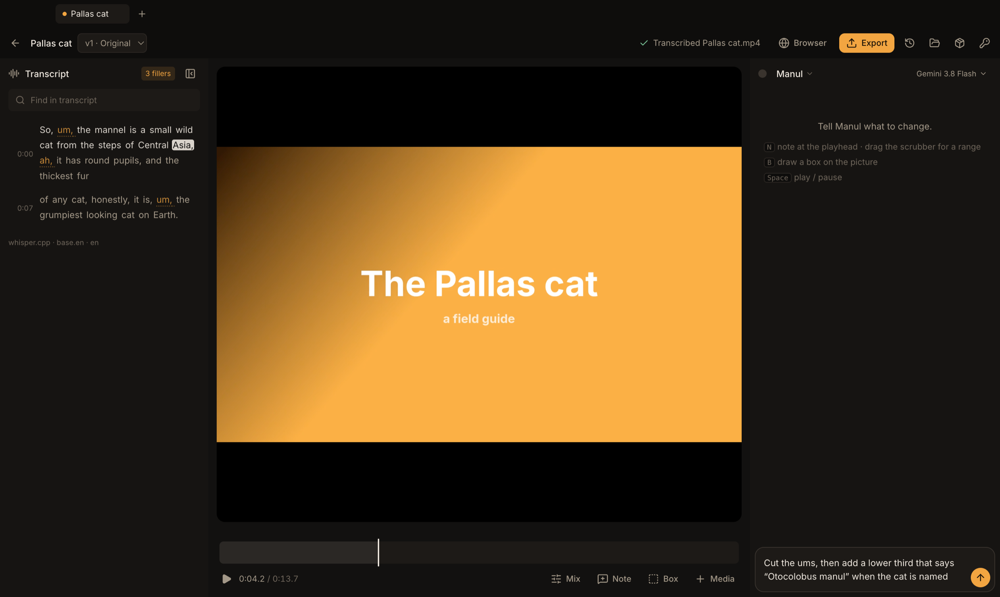

<p align="center">
  
</p>

<h1 align="center">Manul</h1>

<p align="center">
  <b>The video editor you talk to.</b><br>
  Drop in a video, say what you want, and Manul does the edit.<br>
  Then leave notes right on the picture, and it fixes them.
</p>

<p align="center">
  
  
  <a href="LICENSE"></a>
</p>

<p align="center">
  <a href="#get-manul"><b>Get Manul</b></a> &nbsp;·&nbsp;
  <a href="ROADMAP.md"><b>Roadmap</b></a> &nbsp;·&nbsp;
  <a href="CONTRIBUTING.md"><b>Contribute</b></a>
</p>

<br>

<p align="center">
  
</p>

<br>

<p align="center">
  <i>Named after the <b>manul</b>, the Pallas cat: small, patient, very good at its job,<br>and completely unbothered by anything.</i>
</p>

<br>

## Editing, without the editing

Most of editing isn't cutting. It's **watching, reacting and fixing**. Manul turns that loop into the whole product.

<table>
<tr>
<td width="25%" align="center" valign="top">
<h3>① Drop</h3>
Drop in any video.<br>Manul reads every word that's said.
</td>
<td width="25%" align="center" valign="top">
<h3>② Ask</h3>
<i>"Cut the ums."</i><br><i>"Add a title card."</i><br><i>"Put my name on screen."</i>
</td>
<td width="25%" align="center" valign="top">
<h3>③ Watch</h3>
Every change comes back as a <b>before / after</b>. Keep it or send it back.
</td>
<td width="25%" align="center" valign="top">
<h3>④ Point</h3>
Draw a box on the frame and say what's wrong. It fixes <i>that</i>.
</td>
</tr>
</table>

<p align="center">Then export for YouTube, Shorts, Reels or TikTok, with captions burned in or as a file.</p>

## What you can do

<table>
<tr>
<td width="50%" valign="top">

### 🎬 Edit by talking
Ask for cuts in plain words. Manul plans them from what's actually said, word by word, and gets it right in one go.

### 📍 Notes on the picture
Draw a box, pick a moment, drag across a range, or click a single word in a title. Your note lands exactly there.

### ✨ Titles and motion, made for you
Title cards, lower thirds, captions, callouts and animated text, designed and timed to your film. Drag anything to move it, or ask for just that one thing to change.

### 🎚️ Music that sits right
Add a track and it loops to the length of your film, dipping under every word. You hear the mix live as you change it.

</td>
<td width="50%" valign="top">

### 🌐 It can look things up
Manul has its own browser for research, references and finding footage. It never touches your personal browser, unless you ask it to.

### 🧠 It learns your taste
Tell it once ("I like captions in yellow") and it remembers, in every project.

### 🕰️ Nothing is ever lost
Every change is saved as a step you can go back to. Try anything.

### 🗂️ Many projects at once
Keep several films open in tabs, each with its own conversation, and pick the AI model you like for each.

</td>
</tr>
</table>

## Yours, and private

<table>
<tr>
<td align="center" width="33%" valign="top">
<h3>💻</h3>
<b>On your computer</b><br>
Your footage never leaves your machine. Even the transcription happens on it.
</td>
<td align="center" width="33%" valign="top">
<h3>🔑</h3>
<b>Your keys, locked away</b><br>
Bring your own Claude, Gemini or OpenAI key. It's stored in your system's keychain.
</td>
<td align="center" width="33%" valign="top">
<h3>✋</h3>
<b>Asks before it spends</b><br>
Big downloads and anything costly wait for your OK, with the size shown up front.
</td>
</tr>
</table>

<p align="center"><sub>Coming soon: one <b>Manul key</b> for every AI model, so you don't need keys of your own.</sub></p>

## Get Manul

> **Manul is in early days.** Signed downloads are on the way:

```bash
brew install --cask manul      # macOS (coming soon)
sudo apt install manul         # Debian / Ubuntu (coming soon)
```

Until then, you can run it from source. See **[CONTRIBUTING.md](CONTRIBUTING.md)**.

## Where it's going

| | | |
|:-:|---|:-:|
| **Now** | Edit by talking, notes on the picture, titles and motion, music, export | 🚧 |
| **Next** | Send to Premiere, Resolve or Final Cut · publish straight to YouTube | ⬜ |
| **Then** | One Manul key for every model · cloud tools · your favourite apps connected | ⬜ |
| **Later** | Record on your phone straight into a project · client review links · teams | ⬜ |

<p align="center"><b><a href="ROADMAP.md">See the full roadmap →</a></b></p>

## Help make it

Ideas, bug reports and pull requests are all welcome. Start with **[CONTRIBUTING.md](CONTRIBUTING.md)** and the **[roadmap](ROADMAP.md)**.

<br>

<p align="center">
  <br>
  <sub><a href="LICENSE">GPL-3.0</a> &nbsp;·&nbsp; <a href="THIRD_PARTY_NOTICES.md">Third-party notices</a> &nbsp;·&nbsp; Made by <a href="https://github.com/hormuz-labs">Hormuz Labs</a></sub>
</p>
