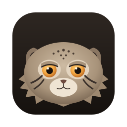
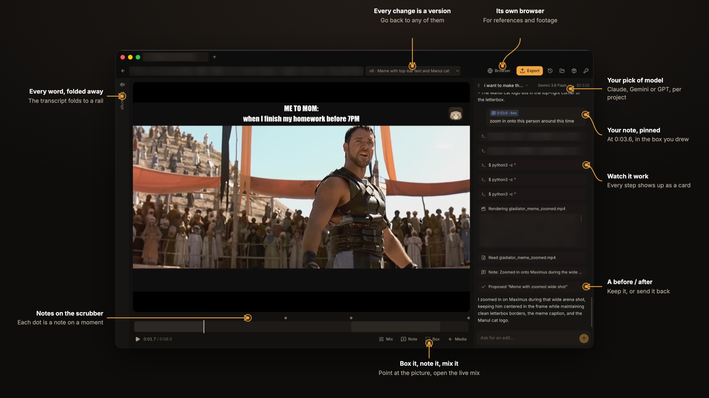
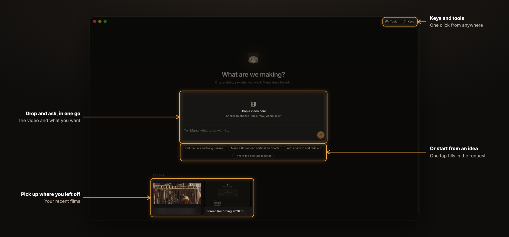
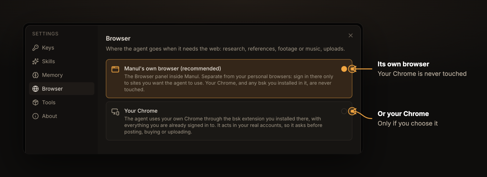
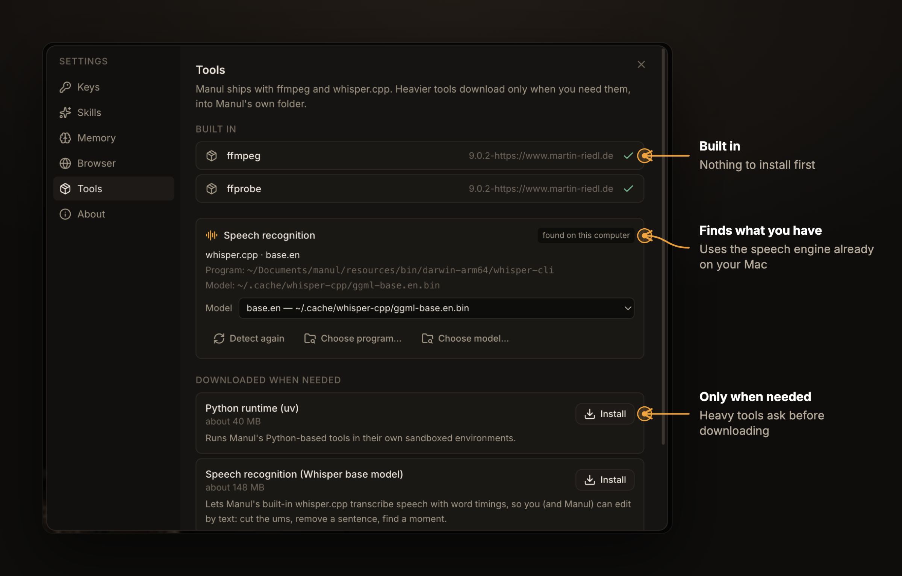

<p align="center">
  
</p>

<h1 align="center">Manul</h1>

<h3 align="center">Direct your video. Manul edits it.</h3>

<p align="center">
  Drop in your footage, say what you want, and point at the frame when something's off.<br>
  Manul makes the cut on your own computer and shows you a before / after of every change.<br>
  You never touch a timeline.
</p>

<p align="center">
  
  
  <a href="LICENSE"></a>
</p>

<p align="center">
  <a href="#get-manul"><b>Get Manul</b></a> &nbsp;·&nbsp;
  <a href="ROADMAP.md"><b>Roadmap</b></a> &nbsp;·&nbsp;
  <a href="CONTRIBUTING.md"><b>Contribute</b></a>
</p>

<br>

https://github.com/user-attachments/assets/084276fb-6129-47e2-9cba-4724c1432990

<p align="center"><sub>90 seconds with Manul, starring the grumpiest cat on Earth. Pallas's cat footage: BBC, <i>Frozen Planet II</i>.</sub></p>

<br>

<p align="center">
  
</p>

<br>

## Why it's different

Video editors make **you** operate them. AI video tools take your footage away and hand back whatever they made. Manul works the way a director works with a good editor in the room.

<table>
<tr>
<td width="50%" valign="top">


### You point. It edits.
Draw a box around a number plate that needs blurring. Drag across the sentence that drags on. Click the one word in a title that's wrong. Your note sits on that exact spot and moment, and that's the spot Manul changes.

</td>
<td width="50%" valign="top">


### It proposes. You decide.
Nothing is overwritten. Every edit arrives as a new version you can scrub before and after, then keep or send back with a reply. Every version you ever kept is one click away.

</td>
</tr>
<tr>
<td width="50%" valign="top">


### Your pixels stay real.
Manul cuts **your** footage. It never swaps your shots for generated ones: generated b-roll is coming, but only where you ask, labelled as generated. Titles, lower thirds and captions are real typography, drawn frame-perfect, and you can still drag the words around after Manul has made them.

</td>
<td width="50%" valign="top">


### Your footage stays home.
No upload queue, no cloud project, no waiting for a render farm. The editing and even the transcription run on your computer. The AI you bring your own key for only ever sees text and still frames.

</td>
</tr>
</table>

## What a session feels like

<p align="center">
  
</p>


> **You:** cut the ums, and the bit where I lose my train of thought
>
> **Manul:** Cut 9 fillers and the restart at 0:42. *2:31 → 2:12.* &nbsp; `before / after` &nbsp; **Keep** · **Send back**
>
> **You:** *(draws a box over a parked car, 0:18–0:24)* blur this number plate
>
> **Manul:** Blurred that box from 0:18 to 0:24. The rest of the shot is untouched.
>
> **You:** put my name on screen when I introduce myself, and add quiet music under the whole thing
>
> **Manul:** Lower third "Sara Malik · Product designer" at 0:04. Music looped to 2:12, dipping under every sentence.
>
> **You:** now a vertical one for Shorts, captions burned in

<sub>An example of the kind of conversation Manul is built for. Every reply comes with a before / after you can scrub.</sub>

## What's in the box

<table>
<tr>
<td width="56" align="center"></td>
<td><b>Word-accurate cuts</b><br>Every spoken word is transcribed with its timing, so "cut the ums" or "drop the second take" lands on the exact word</td>
</tr>
<tr>
<td width="56" align="center"></td>
<td><b>Titles it designs</b><br>Title cards, lower thirds, callouts and animated text, timed to your film and editable by hand</td>
</tr>
<tr>
<td width="56" align="center"></td>
<td><b>A mix you hear live</b><br>Music loops to the length of your film and ducks under speech. Move a slider and you hear it at once, before anything renders</td>
</tr>
<tr>
<td width="56" align="center"></td>
<td><b>One film, every shape</b><br>16:9 for YouTube, 9:16 for Shorts, Reels and TikTok, 1:1 for feeds, with captions burned in or as a file</td>
</tr>
<tr>
<td width="56" align="center"></td>
<td><b>Its own browser</b><br>It looks up references and finds footage in a browser of its own, never yours, unless you switch that on</td>
</tr>
<tr>
<td width="56" align="center"></td>
<td><b>A memory for taste</b><br>Say "captions are always yellow" once and every project after that knows it</td>
</tr>
<tr>
<td width="56" align="center"></td>
<td><b>Tabs and any model</b><br>Several films open at once, each with its own conversation. Claude, Gemini or GPT, picked per project</td>
</tr>
</table>

## You stay in charge

<table>
<tr>
<td width="50%" valign="top" align="center">

<br><b>Which browser it uses</b><br>
<sub>Its own, by default. Yours only if you say so.</sub>
</td>
<td width="50%" valign="top" align="center">

<br><b>What it installs</b><br>
<sub>Nothing heavy until you ask, and it uses what you already have.</sub>
</td>
</tr>
</table>

## Get Manul

> **Manul is in early days.**

```bash
brew install hormuz-labs/tap/manul     # macOS
```

Or hand it to your coding agent (Claude Code, Cursor, Codex…) and let it do the install:

```text
Install Manul from https://github.com/hormuz-labs/manul. On macOS run `brew install hormuz-labs/tap/manul`. On Debian or Ubuntu, add the apt repository at https://apt.manul.si (the three commands are on that page) and run `sudo apt install manul`; on other Linux, download the AppImage for this machine's architecture from https://github.com/hormuz-labs/manul/releases/latest. Then open Manul.
```

On Debian or Ubuntu, add the signed apt repository once and apt keeps Manul up to date:

```bash
curl -fsSL https://apt.manul.si/manul.gpg | sudo gpg --dearmor -o /usr/share/keyrings/manul.gpg
echo "deb [signed-by=/usr/share/keyrings/manul.gpg] https://apt.manul.si stable main" | sudo tee /etc/apt/sources.list.d/manul.list
sudo apt update && sudo apt install manul
```

Other Linux: grab the AppImage from the [latest release](https://github.com/hormuz-labs/manul/releases/latest). More at **[manul.si](https://manul.si)**.

It's free and open source. Bring a Claude, Gemini or OpenAI key (it's kept in your system's keychain), or wait for the single **Manul key**, coming soon.

On first run Manul asks whether to send crash reports and usage statistics. Both boxes start unticked, and you can change them anytime in Settings → About. It never sends your footage, file or project names, prompts, transcripts or keys. [Exactly what is sent](telemetry/README.md).

Want to hack on it? Run it from source with **[CONTRIBUTING.md](CONTRIBUTING.md)**.

## Where it's going

<table>
<tr>
<td width="72"><b>Now</b></td>
<td>Directing by talking and pointing, titles, music, every export shape</td>
<td width="40" align="center"></td>
</tr>
<tr>
<td width="72"><b>Next</b></td>
<td>Hand the cut to Premiere, Resolve or Final Cut · publish straight to YouTube</td>
<td width="40" align="center"></td>
</tr>
<tr>
<td width="72"><b>Then</b></td>
<td>One Manul key for every model · heavy tools in the cloud · your apps connected</td>
<td width="40" align="center"></td>
</tr>
<tr>
<td width="72"><b>Later</b></td>
<td>Shoot on your phone straight into a project · clients leave notes on the frame · teams</td>
<td width="40" align="center"></td>
</tr>
</table>

<p align="center"><b><a href="ROADMAP.md">See the full roadmap →</a></b></p>

<br>

<p align="center">
  <br>
  <sub>Named after the <b>manul</b>, the Pallas cat: small, patient, and unbothered by anything.</sub><br>
  <sub><a href="LICENSE">GPL-3.0</a> &nbsp;·&nbsp; <a href="THIRD_PARTY_NOTICES.md">Third-party notices</a> &nbsp;·&nbsp; <a href="CONTRIBUTING.md">Contribute</a> &nbsp;·&nbsp; Made by <a href="https://github.com/hormuz-labs">Hormuz Labs</a></sub>
</p>
