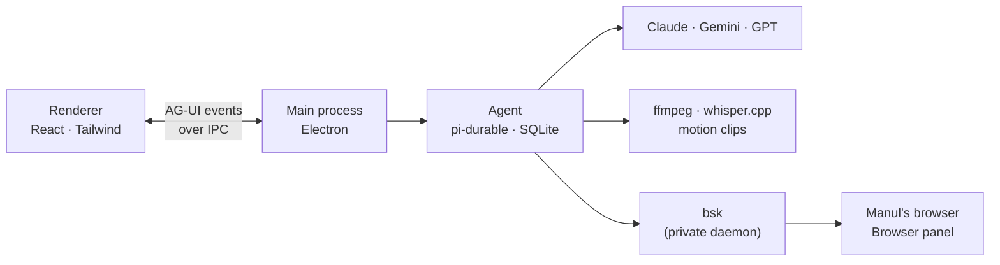

<p align="center">
  
</p>

<h1 align="center">Manul</h1>

<p align="center">
  <b>The video editor you talk to.</b><br>
  Drop in a video, say what you want, and Manul does the edit.<br>
  Then leave notes right on the picture, and it fixes them.
</p>

<p align="center">
  <a href="https://github.com/hormuz-labs/manul/actions/workflows/ci.yml"></a>
  
  <a href="LICENSE"></a>
  
</p>

<p align="center">
  <a href="ROADMAP.md"><b>Roadmap</b></a> &nbsp;·&nbsp;
  <a href="#contributing"><b>Contribute</b></a> &nbsp;·&nbsp;
  <a href="#quick-start"><b>Quick start</b></a> &nbsp;·&nbsp;
  <a href="RELEASING.md"><b>Releasing</b></a>
</p>

<br>

<p align="center">
  
</p>

<br>

> Named after the **manul**, the Pallas cat: small, patient, very good at its job, and unbothered by anything.

## How it works

| | | |
|:-:|---|---|
| **1** | **Drop a video** | Manul reads it, makes a smooth preview copy if needed, and transcribes every word, on your machine. |
| **2** | **Say what you want** | *"Cut the ums." "Add a title card." "Put my name in a lower third." "Duck the music under my voice."* |
| **3** | **Watch, then decide** | Every change arrives as a **before / after** you can scrub. Accept it, reject it, or reply. |
| **4** | **Point at the problem** | Draw a box on the frame, pick a moment or a range, or click one word in a title, and say what's wrong. |

Then export: 16:9, 9:16 or 1:1, with captions burned in or as a file.

## What's inside

<table>
<tr>
<td width="50%" valign="top">

**🎬 Edits by talking**<br>
Cuts planned from the transcript, word by word. One clean render, never a pile of retries.

**📍 Notes on the picture**<br>
A box on the frame, a time, a range, or a single element. The agent gets your words *and* a still of the frame.

**✨ Motion it makes itself**<br>
Title cards, lower thirds, kinetic type and charts as HTML + GSAP, rendered frame-exact. Drag any text to move it, or ask the agent to change just that one element.

**🎚️ A live mix**<br>
Film level, music looped to length, and ducking under speech that you hear live. The render matches what you heard.

</td>
<td width="50%" valign="top">

**🌐 Its own browser**<br>
The agent browses inside Manul, never in your Chrome. Sign in there only where you want it to go. Or let it use your Chrome, on purpose, in Settings.

**🧠 Memory and skills**<br>
It remembers your taste across projects. Skills are plain `SKILL.md` files you can read, switch with profiles, and edit.

**🕰️ Everything undoable**<br>
Every proposal, accept and edit is a point in the project's history. Go back to any of them.

**🗂️ Tabs, conversations, any model**<br>
Several projects open at once, each with its own agent. Claude, Gemini or GPT: pick per project.

</td>
</tr>
</table>

## Private by default

- **Local first.** Your footage never leaves your machine. Transcription runs locally (whisper.cpp, on the GPU on Macs).
- **Your keys, in your keychain.** Bring your own Anthropic, Gemini or OpenAI key. The interface only ever learns "set" or "not set". *A single Manul key is coming.*
- **A sealed-off browser.** The agent's browser has its own sessions and its own private [BrowserSkill](https://github.com/Tencent/BrowserSkill) daemon, so a bsk you installed in Chrome never sees it.
- **Asks before anything costly.** Big downloads and missing tools show a card with the size first.

## Quick start

> Signed downloads, Homebrew (`brew install --cask manul`) and apt are on the way. For now, run it from source.

```bash
git clone git@github.com:hormuz-labs/manul.git && cd manul
npm install                  # also fetches the pinned ffmpeg/ffprobe and BrowserSkill for this machine
./scripts/build-whisper.sh   # builds the bundled whisper-cli (needs cmake: brew install cmake)
npm run dev                  # Manul, with hot reload
```

Add a key in **Settings → Keys** (⌘,), drop a video on the start screen, and tell it what you want.

## Under the hood



| | |
|---|---|
| **Shell** | Electron: real Chromium for WebCodecs, frame-exact clip rendering and a browser the agent can drive |
| **Agent** | [pi-durable](https://www.npmjs.com/package/@earendil-works/pi-durable): every conversation and tool call is saved before it's shown, so a crash resumes mid-run |
| **Agent ↔ UI** | [AG-UI](https://docs.ag-ui.com) events: tool cards, permission cards and live state |
| **Media** | Our own pinned static ffmpeg 9.0.2 and whisper.cpp builds; heavy tools download on demand, checksummed |
| **Updates** | The app via GitHub releases; skills over the air from an Ed25519-signed feed |

<details>
<summary><b>Develop</b></summary>

<br>

```bash
npm run dev          # the app with hot reload
npm run typecheck
npm run smoke        # builds, launches the app, screenshots each screen (set GEMINI_API_KEY and pass a prompt to test the agent)
node scripts/screenshot.mjs   # retakes docs/screenshot.png
```

| Folder | What lives there |
|---|---|
| `src/main` | Electron main: projects, keys, media tools, the agent and its AG-UI adapter, the browser and bsk |
| `src/preload` | The bridge to the window, and the Chrome extension API rebuilt for BrowserSkill |
| `src/renderer` | React + Tailwind; `views/` are the screens, `components/ui/` the primitives |
| `src/shared` | Types and pure logic used on both sides (timeline, export, mix) |
| `resources` | Bundled skills, clip runtime, fonts; `bin/` and `bsk-ext/` are fetched on install |

</details>

<details>
<summary><b>Tests</b></summary>

<br>

Manul is test-driven: every change comes with tests.

```bash
npm test           # unit + integration (Vitest); Electron is stubbed, ffmpeg is real
npm run test:e2e   # the real app (Playwright): clips, export, menu, proxies, tabs, mix, browser, conversations
npm run package:dir && node test/e2e/packaged.e2e.mjs   # the packaged app: tools, clips, skills, export from the bundle
MANUL_TEST_TOOLS=<tools folder with whisper installed> npm test   # also runs the downloaded-engine test
```

Integration tests that need something this machine lacks (whisper.cpp, macOS `say`, an installed tool) skip themselves.

</details>

<details>
<summary><b>Packaging</b></summary>

<br>

```bash
npm run package    # dist/: macOS .dmg + .zip, or Linux .deb + AppImage
```

Signing, notarizing, the Homebrew cask and the apt repository run in CI. See [RELEASING.md](RELEASING.md).

</details>

## Roadmap

| Phase | | Status |
|---|---|:-:|
| **0 · Foundations** | Shell, agent, AG-UI, keys, bundled tools, CI | 🚧 |
| **1 · MVP** | Edit by talking, notes on the picture, motion clips, export, browser | 🚧 |
| **2 · Hand-off** | Premiere / Resolve / Final Cut export, YouTube publishing | ⬜ |
| **3 · Manul key & Pro** | One key for every model, cloud tools, integrations | ⬜ |
| **4 · Cloud, mobile, teams** | Storage, a phone app, client review links | ⬜ |

**[Read the full roadmap →](ROADMAP.md)**

## Contributing

Ideas, issues and pull requests are welcome. The [roadmap](ROADMAP.md#how-to-contribute) says how to pick up an item. Keep pull requests small and bring tests with them.

## License

[GPL-3.0](LICENSE). Bundled third-party software and its licences are listed in [THIRD_PARTY_NOTICES.md](THIRD_PARTY_NOTICES.md).

<br>

<p align="center"><sub>Made by <a href="https://github.com/hormuz-labs">Hormuz Labs</a></sub></p>
